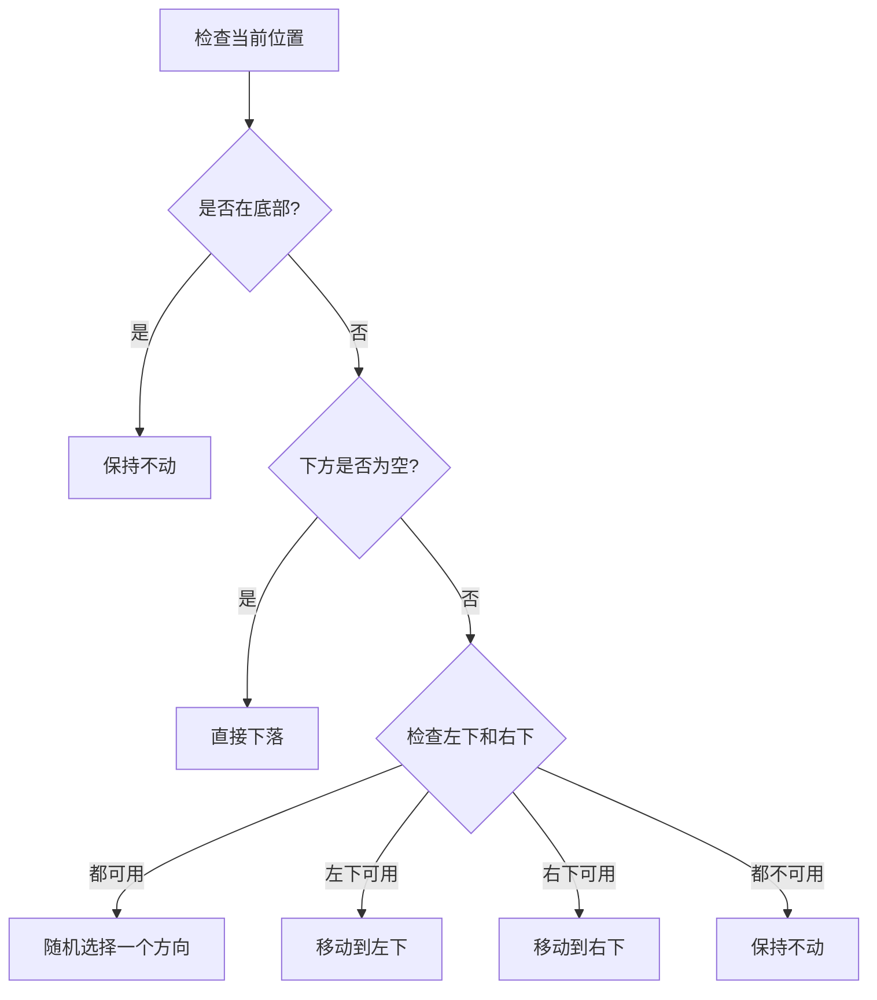
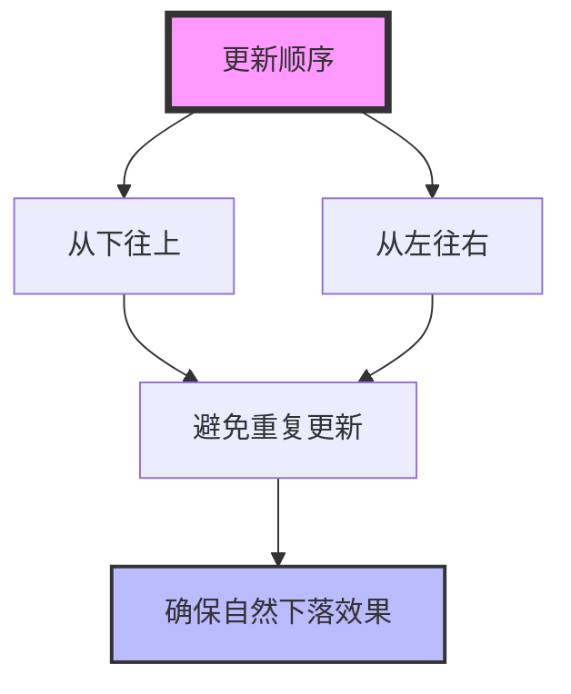

# 老鸟教你实现超有趣的 emoji 下落效果

又是一个阳光明媚的下午，小菜正在公司的休息区里摆弄着手机。突然，他被一个有趣的小游戏吸引住了 —— 屏幕上五颜六色的表情符号像沙子一样缓缓下落，随着手指的触摸，新的表情符号不断出现，堆积成一座座可爱的小山丘。

"哇！这效果也太有意思了吧！"小菜兴奋地喊道。

正在泡咖啡的老鸟闻声走了过来："咦，这不是经典的沙子下落效果吗？只不过把沙粒换成了表情符号而已。"

小菜眼睛一亮："老鸟，你懂这个？快教教我怎么实现！"

老鸟端着咖啡，悠悠地说："这个效果看起来复杂，其实原理很简单。你想象一下，整个屏幕就像一个大网格，每个格子要么是空的，要么放着一个表情符号。表情符号会不断检查下方的情况来决定自己的下一步行动。"

"就像下棋时要观察周围的格子一样？"小菜若有所思。

"没错！"老鸟赞许地点点头，"我们可以把整个逻辑分解成几个关键步骤：

1. 首先，我们需要创建一个网格系统来存放这些表情符号
2. 然后，让表情符号能够响应重力，也就是向下掉落
3. 最后，处理表情符号遇到障碍时的行为"

小菜掏出笔记本，认真地记录着："那具体该怎么实现呢？"

老鸟打开电脑，调出代码："我们先来看看基础设置。首先需要定义一些常量和变量：

```javascript
const emojis = ['😀', '😂', '🤣', '😊', '😇', '🙂', '🙃', '😉'];  // emoji表情数组
const size = 20;  // 每个格子的大小
let rows, cols;   // 行数和列数
let grid = [];    // 二维网格数组
```

然后在初始化时，我们要创建一个空的网格系统："

小菜凑近屏幕："这个 grid 数组就是你说的那个大网格吧？为什么要用二维数组呢？"

"对，"老鸟点点头，"二维数组很适合表示网格结构。第一维表示行，第二维表示列。我们用 null 表示空格子，用表情符号字符串表示有emoji的格子。来看初始化的代码：

```javascript
// 计算行列数
rows = floor(height / size);
cols = floor(width / size);

// 初始化网格
for (let i = 0; i < rows; i++) {
    grid[i] = [];
    for (let j = 0; j < cols; j++) {
        grid[i][j] = null;
    }
}
```

小菜若有所思："这样每个格子的位置就能用行号和列号来确定了。那表情符号是怎么出现的呢？"

"很简单，"老鸟指着代码继续说，"我们监听鼠标拖动事件，当用户拖动鼠标时，就在对应位置放置一个随机的表情符号：

```javascript
function mouseDragged() {
    let gridX = floor(mouseX / size);
    let gridY = floor(mouseY / size);
    
    if (gridX >= 0 && gridX < cols && gridY >= 0 && gridY < rows) {
        grid[gridY][gridX] = random(emojis);
    }
}
```

"那下落效果呢？"小菜追问道，"看起来表情符号下落得很自然。"

老鸟喝了口咖啡："这就是最关键的部分了。每一帧我们都要检查所有表情符号，让它们根据周围的情况决定下一步行动。"

"这个网格就像一个大型的棋盘，"老鸟继续解释道，"每个格子都有明确的坐标位置。再来看看表情符号的移动逻辑："



"每个表情符号在每一帧都会执行这个决策流程，"老鸟指着流程图说，"就像真实的沙子一样，它们会找到一条合适的路径往下流动。"

```javascript
function updateEmojiPosition(i, j) {
    if (i === rows - 1) return;  // 已经在底部就不用动了
    
    if (!grid[i + 1][j]) {  // 下方为空，直接下落
        grid[i + 1][j] = grid[i][j];
        grid[i][j] = null;
    } else {  // 下方有障碍，检查左下和右下
        let leftAvailable = j > 0 && !grid[i + 1][j - 1];
        let rightAvailable = j < cols - 1 && !grid[i + 1][j + 1];
        
        if (leftAvailable && rightAvailable) {
            // 随机选择左下或右下
            let goLeft = random() < 0.5;
            if (goLeft) {
                grid[i + 1][j - 1] = grid[i][j];
            } else {
                grid[i + 1][j + 1] = grid[i][j];
            }
            grid[i][j] = null;
        } else if (leftAvailable) {
            // 只能去左下
            grid[i + 1][j - 1] = grid[i][j];
            grid[i][j] = null;
        } else if (rightAvailable) {
            // 只能去右下
            grid[i + 1][j + 1] = grid[i][j];
            grid[i][j] = null;
        }
    }
}
```

"哦！"小菜恍然大悟，"这就像沙子下落时的物理规则：如果下面有空位就直接掉下去，如果被挡住了就会往旁边滑。"

突然小菜又想到了什么："那更新的顺序是不是很重要？"

"确实！"老鸟画出了一张图：



"如果我们从上往下更新，上面的表情符号可能会追着下面的一起移动，看起来就像瞬移一样。从下往上更新可以确保每个表情符号都只移动一次，产生平滑的下落效果。"

老鸟喝完最后一口咖啡："编程就是这样，很多看似复杂的效果，其实都是由简单的规则组合而成。关键是要学会把大问题拆解成小问题，一步一步去解决。"

"学到了学到了！"小菜兴奋地合上笔记本，"我这就去实现一个，等着被同事们夸赞吧！"

老鸟看着小菜蹦蹦跳跳离开的背影，忍不住笑出了声。这个年轻人总是这么充满热情，就像一个永远装不满的知识海绵。他拿起空了的咖啡杯，望着窗外的阳光，心想：也许下次该教他做个能下巧克力雨的特效？不过在那之前，得先看看他能把这个表情符号下落玩出什么花样来。

毕竟在代码的世界里，每一个看似简单的效果，都是一次探索的冒险。而最令人着迷的，永远不是那些花里胡哨的表象，而是破解背后奥秘时的那份惊喜与快乐。
