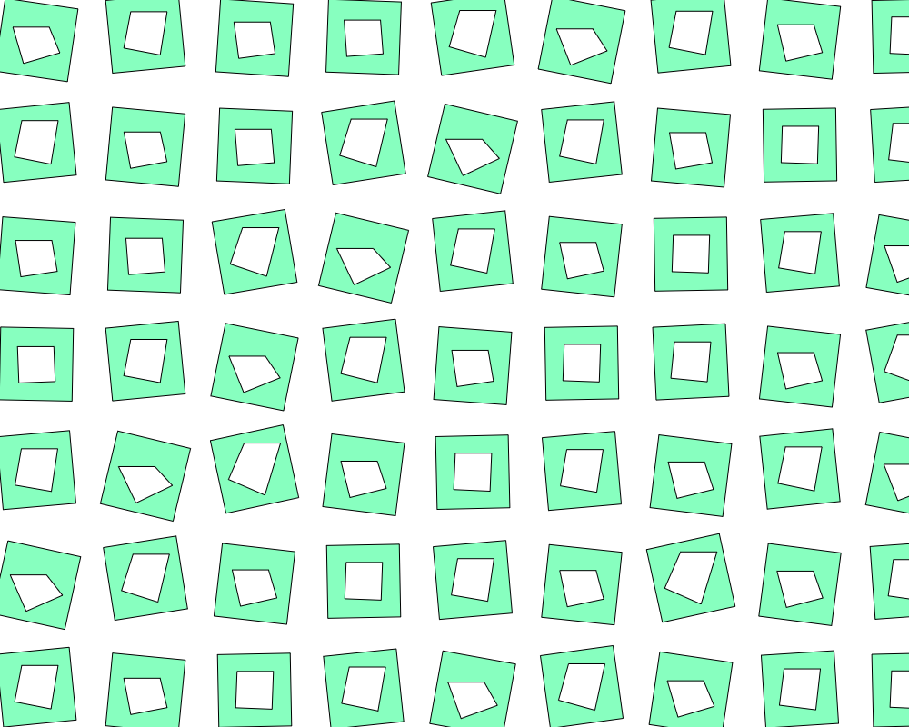

# Processing 100 天速写

## 我来笔记

[https://www.wolai.com/childhoodandy/nFdnVWMHkYxtb6QgBxHDJx?theme=dark](https://www.wolai.com/childhoodandy/nFdnVWMHkYxtb6QgBxHDJx?theme=dark)

## 关于我

公众号、视频号、Bilibiii：小菜与老鸟

## 预览

### Day_001

- 描述：渐变圆
- 重要知识点：translate、lerpColor、line

### Day_002

- 描述：水的涟漪、波纹
- 重要知识点：circle、stroke

### Day_003

- 描述：遮罩的用法、不规则图形遮罩、线性渐变
- 重要知识点：PGraphics、mask、lerpColor、vertex

### Day_004

- 描述：发光的几种实现方式
- 重要知识点：filter、BLUR

### Day_005

- 描述：旋转的“冰激凌”
- 重要知识点：arc、lerp、sin、cos

### Day_006

- 描述：视频马赛克处理
- 重要知识点：video、Capture

### Day_007

- 描述：识别指尖颜色生成平台与小球碰撞
- 重要知识点：video、Capture、Box2d

### Day_008

- 描述：曲线运动轨迹-动态
- 重要知识点：ellipse、sin、cos

### Day_009

- 描述：瞅你咋滴
- 重要知识点：PVector

### Day_010

- 描述：叠加旋转方块的声音可视化练习
- 重要知识点：Array、minim

### Day_011

- 描述：镜像绘画的秘密
- 重要知识点：line

### Day_012

- 描述：彩色纹理
- 重要知识点：noise

### Day_013

- 描述：粒子的音乐躁动
- 重要知识点：noise、sound

### Day_014

- 描述：初识3D方块
- 重要知识点：P3D、box

### Day_015

- 描述：tiled contour
- 重要知识点：p5js beginContour endContour

### Day_016

- 描述：curveTightness
- 重要知识点：curveTightness

### Day_017

- 描述：字体点阵
- 重要知识点：textToPoints

### Day_018

- 描述：noise静态流场
- 重要知识点：noise

### Day_019

- 描述：Grid的波浪运动
- 重要知识点：sin、cos、keyPressed()、keyCode

### Day_020

- 描述：球体阴影练习
- 重要知识点：sphere、spotLight

### Day_021

- 描述：loading
- 重要知识点：HSB、sin、cos

### Day_022

- 描述：drawingContext的clip
- 重要知识点：drawingContext

### Day_023

- 描述：区块链鸟
- 重要知识点：rect、arc、drawingContext等

### Day_024

- 描述：字体像素化
- 重要知识点：loadPixels、updatePixels

### Day_025

- 描述：暂无
- 重要知识点：暂无

### Day_026

- 描述：字体的噪波缩放
- 重要知识点：noise

### Day_027

- 描述：国庆头像生成器
- 重要知识点：PGraphics、selectInput

 

 

### Day_028

- 描述：递归圆
- 重要知识点：递归

### Day_029

- 描述：场景的渐隐渐现过渡
- 重要知识点：ArrayList

### Day_030

- 描述：加载svg
- 重要知识点：loadShape

### Day_031

- 描述：图层的透明、半透明等
- 重要知识点：PGraphics、beginDraw、endDraw、clear

### Day_032

- 描述：p5js 手部识别 Handtrack
- 重要知识点：Handtrack.js

### Day_033

- 描述：P3D 练习
- 重要知识点：beginShape、endShape、vertex

### Day_034

- 描述：完美gif loop
- 重要知识点：无

### Day_035

- 描述：生成svg
- 重要知识点：svg

### Day_036

- 描述：
- 重要知识点：

### Day_037

- 描述：字体轮廓
- 重要知识点：PFont、PShape、getVertexCount、getVertex

### Day_038

- 描述：加载图片显示字体像素
- 重要知识点：loadPixels、updatePixels

### Day_039

- 描述：待补充
- 重要知识点：

### Day_040

- 描述：播放gif动图
- 重要知识点：gif-animation

### Day_041

- 描述：播放gif动图，控制动画速度
- 重要知识点：image

### Day_042

- 描述：使用精灵图播放动图
- 重要知识点：get(x, y, width, height), JSONObject

